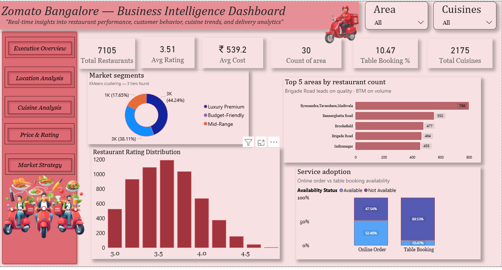
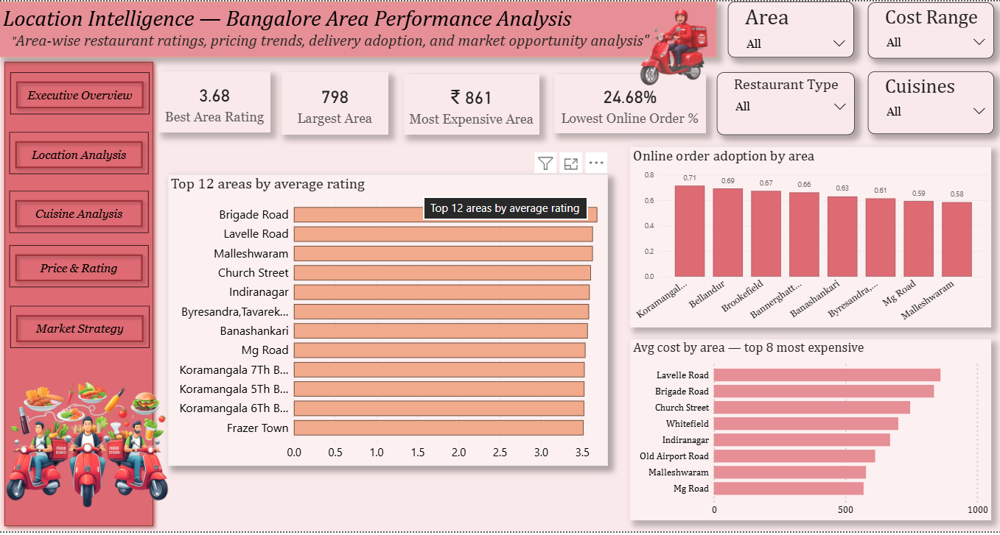
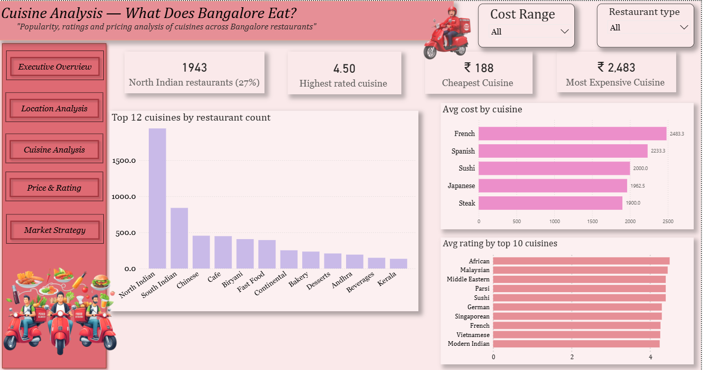
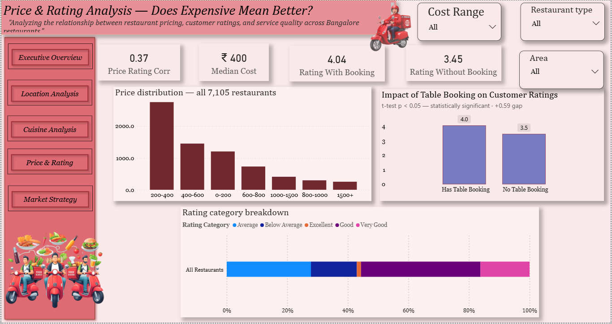
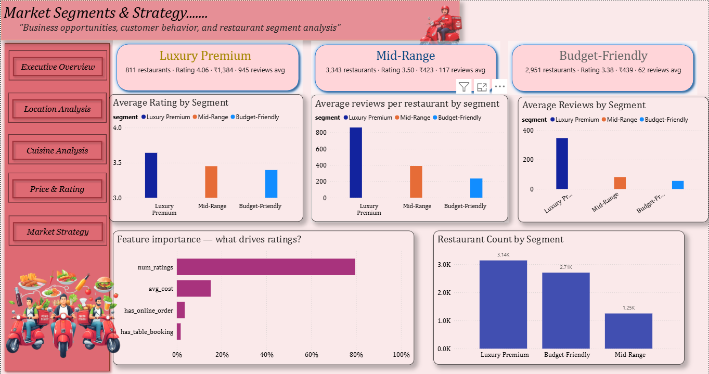

# 🍽️ Zomato-Banglore-Restaurants-Analysis

<div align="center">


**Real-time insights into restaurant performance, Customer Behavior, Location Analysis, Cuisines Analysis,  Business & Market Strategy**

[](https://www.linkedin.com/in/mahi-shukla-921551272/)
[](http://127.0.0.1:5500/Livedashbord/zomato_live_dashboard.html)
[](mailto:mahishukla580@gmail.com)

</div>

---

## 📌 Project Overview

This project performs a **complete industry-level data analysis** of **7,105 restaurants** across **30 areas** in Bangalore using the Zomato dataset. The analysis covers everything from raw data cleaning to advanced machine learning clustering, resulting in a **5-page interactive Power BI dashboard** that answers real business questions for food-tech companies like Zomato and Swiggy.

> **Role played:** Data Analyst for Zomato's Business Intelligence Team  
> **Objective:** Turn raw scraped restaurant data into actionable decisions for product, marketing, and expansion teams.

---

## 🚀 Live Dashboard

<div align="center">

This Business Intelligence dashboard has been deployed as an interactive web application.

| Platform | Link |
|---|---|
| 🌐 Live Dashboard | [View Live Dashboard](http://127.0.0.1:5500/Livedashbord/zomato_live_dashboard.html)  |
| 📁 GitHub Repository | [View Source Code](https://github.com/mahaishukla-2223333/Zomato-Banglore-Restaurants-Analysis) |
| 📧 Contact | (mahishukla580@gmail.com) |

</div>

### Dashboard Preview

| Page | Description |
|---|---|
| **Page 1 — Executive Overview** | KPI cards, market segments, rating distribution, service adoption |
| **Page 2 — Location Analysis** | Top areas by rating, cost comparison, online adoption by area |
| **Page 3 — Cuisine Analysis** | Cuisine dominance, ratings, pricing across 85 cuisine types |
| **Page 4 — Price & Rating** | Price-rating correlation, table booking impact (t-test proven) |
| **Page 5 — Market Strategy** | KMeans segments, feature importance, business opportunities |

---

## 🔑 Key Findings

> These are the 5 most important insights from this analysis:

| # | Finding | Numbers |
|---|---|---|
| ⭐ | **Table booking = quality signal** — restaurants with table booking rate significantly higher | 4.04 vs 3.45 avg rating (t-test p < 0.05, +0.59 gap) |
| 🍛 | **North Indian dominates Bangalore** — counter-intuitive in a South Indian city | 1,943 restaurants (27%) vs South Indian 841 (12%) |
| 💰 | **Price does NOT guarantee quality** | Price-rating correlation = only 0.38 (weak) |
| 🏪 | **Premium segment is elite minority** | Only 11.4% of restaurants (811) but avg rating 4.06 and 945 reviews vs 62 for budget |
| 📍 | **Brigade Road leads quality, BTM leads volume** | Brigade Road: 3.68 rating · BTM Layout: 798 restaurants |

---

## 📊 Dataset

| Property | Value |
|---|---|
| **Source** | Zomato Bangalore (scraped data) |
| **Rows** | 7,105 restaurants |
| **Columns** | 12 raw → 20+ after feature engineering |
| **Coverage** | 30 areas, 85 cuisine types, 2 years |
| **Price range** | ₹40 – ₹6,000 for two people |
| **Rating range** | 1.8 – 4.9 |

---

## 🗂️ Project Structure

```
📦 Zomato-Bangalore-Restaurants-Analysis
│
├── 📈 Dashboard
│   │
│   ├── 📸 screenshot
│   │   ├── page1.png
│   │   ├── page2.png
│   │   ├── page3.png
│   │   ├── page4.png
│   │   └── page5.png
│   │
│   ├── 📊 zomato.pbix
│   └── 📄 zomato.pdf
|
├── 📊 Livedashboard
│   ├── index.html
│   ├── style.css
│   ├── script.js
│   └── assets/
│
├── 📓 Notebook
│   ├── 01_data_understanding.ipynb   ← Shape, dtypes, missing values, basic stats
│   ├── 02_data_cleaning.ipynb        ← Encoding fix, rename, missing values, duplicates
│   ├── 03_feature_engineering.ipynb  ← Rating categories, cost tiers, cuisine features
│   ├── 04_eda_statistics.ipynb       ← Descriptive stats, skewness, kurtosis, correlation
│   ├── 05_price_analysis.ipynb       ← Price distribution, segments, price vs rating
│   ├── 06_location_analysis.ipynb    ← Area ratings, cost, online adoption
│   ├── 07_cuisine_analysis.ipynb     ← Cuisine dominance, ratings, market gaps
│   ├── 08_business_strategy.ipynb    ← Opportunity analysis, market gaps, recommendations
│   ├── 09_rating_analysis.ipynb      ← Rating distribution, table booking impact
│   ├── 10_advanced_analysis.ipynb    ← KMeans clustering, PCA, Random Forest
│   └── 11_statistical_analysis.ipynb ← T-test, ANOVA, Chi-square, Cohen's d
│
├── 📂 Zomato_datasets
│   ├── zomato_cleaned.csv
│   ├── area_performance.csv
│   ├── cuisine_performance.csv
│   ├── restaurant_segments.csv
│   ├── segment_performance.csv
│   └── feature_importances.csv
│
├── 📜 README.md

```

---

## 🔬 Analysis Phases

### Phase 1–3: Data Foundation
- **01 Data Understanding** — Identified encoding errors, 125 missing values, 0 duplicates
- **02 Data Cleaning** — Fixed latin-1 encoding, renamed 10 columns, extracted primary cuisine from 2,175 combinations, grouped 81 restaurant types into 7 categories
- **03 Feature Engineering** — Created rating_category, price_segment, value_score, num_cuisines, is_premium flags

### Phase 4: EDA & Statistics
- Descriptive stats: mean, median, std, IQR, skewness, kurtosis
- Correlation matrix — table_booking has strongest correlation with rating (0.35)
- Cross-tabulations and groupby analysis across all dimensions

### Phase 5–9: Domain Analysis
- **Price:** Right-skewed distribution, median ₹400, weak price-quality correlation
- **Location:** Brigade Road leads quality (3.68), BTM leads volume (798 restaurants)
- **Cuisine:** North Indian dominance counter-intuitive finding
- **Business:** Market gap analysis, online adoption opportunities
- **Rating:** Table booking impact proven with statistical testing

### Phase 10–11: Advanced Analysis
- **KMeans Clustering** (k=3, elbow + silhouette method) → 3 market segments
- **PCA** for 2D cluster visualisation
- **Random Forest** for feature importance — num_ratings most predictive
- **Statistical Tests:** Shapiro-Wilk, t-test, Mann-Whitney U, Chi-square, ANOVA, Cohen's d

---

## 🛠️ Technologies Used

| Category | Tools |
|---|---|
| **Language** | Python 3.12 |
| **Data manipulation** | Pandas, NumPy |
| **Visualisation** | Matplotlib, Seaborn, Plotly |
| **Machine learning** | Scikit-learn (KMeans, PCA, Random Forest, StandardScaler) |
| **Statistical tests** | SciPy (ttest_ind, mannwhitneyu, chi2_contingency, f_oneway) |
| **Dashboard** | Microsoft Power BI Desktop |
| **Notebook** | Jupyter Notebook |
| **Version control** | Git + GitHub |

---

## 📈 Dashboard Pages

### Page 1 — Executive Overview
KPI cards · Market segment donut · Rating histogram · Service adoption · Top 5 areas



### Page 2 — Location Analysis  
Top 12 areas by rating (colour-coded) · Online adoption by area · Cost comparison · Bubble chart



### Page 3 — Cuisine Analysis
North Indian vs South Indian insight · Rating by cuisine · Cost by cuisine · 85 unique cuisines



### Page 4 — Price & Rating
Price distribution · **Table booking star chart** (4.04 vs 3.45, t-test p<0.05) · Rating category breakdown



### Page 5 — Market Strategy
3-segment KPI cards · Segment rating comparison · Reviews per segment · Feature importance




---

## ▶️ How to Run

### Python Notebooks
```bash
# Clone the repository
git clone https://github.com/MahiShukla-ms/Zomato-Banglore-Restaurants-Analysis.git
cd zomato-Banglore-Restaurants-Analysis

# Install dependencies
pip install pandas numpy matplotlib seaborn plotly scikit-learn scipy jupyter

# Launch Jupyter
jupyter notebook

# Run notebooks in order: 01 → 02 → 03 → ... → 11
```

### Power BI Dashboard
```
1. Download Zomato_BI_Dashboard.pbix from the  zomatoPowerBiDashbord/ folder
2. Open in Power BI Desktop (free download from microsoft.com/powerbi)
3. Update data source paths to point to your local Zomato_datasets/ folder
4. Click Refresh — all 5 pages load with live data
```

---

## 🧠 Statistical Highlights

| Test | Result | Conclusion |
|---|---|---|
| Shapiro-Wilk (rating) | p < 0.05 | Not normally distributed |
| t-test (table booking impact) | p < 0.05 | Statistically significant ✅ |
| Chi-square (rating vs online order) | p < 0.05 | Significant association |
| ANOVA (rating across restaurant types) | p < 0.05 | Significant difference |
| Cohen's d (online order effect) | 0.15 | Small effect size |
| Pearson correlation (price vs rating) | 0.38 | Weak positive |

---

## 🤝 Connect & Feedback

<div align="center">

**Mahi Shukla**  
*Aspiring Data Analyst*

[](https://www.linkedin.com/in/mahi-shukla-921551272/)
[](mailto:mahishukla580@gmail.com)
[](https://github.com/mahaishukla-2223333)

*If you found this project useful, please ⭐ star the repository!*

</div>

---

<div align="center">
Made with ❤️ and 🍕 | Data Source: Zomato Bangalore | © 2025 Mahi Shukla
</div>
